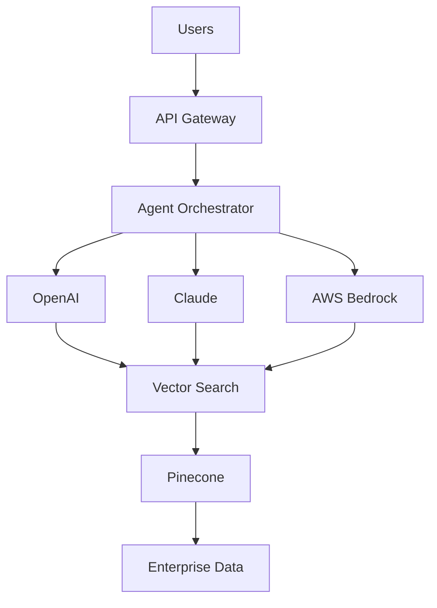

# <div align="center">🚀 Tharun Kumar Nagipogu</div>

<div align="center">

### AI/ML Engineer | Generative AI | Agentic AI | RAG | MLOps | Full-Stack Systems


[](https://git.io/typing-svg)


</div>

---

# 📍 Location & Work Authorization

* Jersey City, New Jersey
* F-1 OPT
* Authorized to work in the United States
* Open to Full-Time, Hybrid, Remote
* Open to Relocation

---

# 💼 Open To Opportunities

* Senior AI Engineer
* Machine Learning Engineer
* Applied AI Engineer
* Generative AI Engineer
* MLOps Engineer
* AI Platform Engineer
* AI Solutions Architect

---

# 📊 AI Engineering Dashboard

| Metric                       | Value                            |
| ---------------------------- | -------------------------------- |
| Experience                   | 4+ Years                         |
| Daily Transactions Processed | 12M+                             |
| Compliance Documents Indexed | 2M+                              |
| Cloud Platforms              | AWS • Azure • GCP                |
| AI Specialization            | GenAI • RAG • Agents             |
| Core Domains                 | Fraud Detection • Risk Analytics |
| Full Stack Products          | Mobile + Backend + AI            |
| Current Venture              | YOO RideShare                    |

---

# 🚀 Executive Snapshot

AI/ML Engineer with 4+ years of experience designing and deploying enterprise AI solutions across banking, compliance, risk analytics, fraud detection, Generative AI, and full-stack product development.

### Highlights

* 🏦 Experience with Capital One and HCLTech
* 🤖 Specialized in GenAI, RAG, AI Agents, LLMOps, and MLOps
* 💳 Built systems processing 12M+ financial transactions daily
* 📚 Developed enterprise RAG systems over 2M+ compliance documents
* 🚖 Founder and builder of YOO RideShare Platform
* ☁️ Multi-cloud experience across AWS, Azure, and GCP

---

# 📈 Engineering Impact

| Domain                 | Scale                      |
| ---------------------- | -------------------------- |
| Financial Transactions | 12M+/day                   |
| Compliance Documents   | 2M+                        |
| AI Infrastructure      | Enterprise Scale           |
| Cloud Platforms        | AWS, Azure, GCP            |
| Real-Time Systems      | Fraud Detection & Dispatch |
| Mobile Applications    | YOO RideShare              |

---

# 🧠 Technology Heatmap

```text
LLMs               ██████████████ 95%
RAG                ██████████████ 95%
AI Agents          ██████████████ 95%
MLOps              █████████████  90%
Cloud              █████████████  90%
Data Engineering   ███████████    85%
System Design      ███████████    85%
Full Stack         ███████████    85%
```

# ⚡ Technology Command Center

### AI / ML / GenAI

Python • PyTorch • TensorFlow • Scikit-Learn • XGBoost • LightGBM • NLP • Deep Learning • OpenAI • Claude • LangChain • LangGraph • LlamaIndex • Pinecone

### Cloud / MLOps

AWS • Azure • GCP • Docker • Kubernetes • MLflow • SageMaker • GitHub Actions • Kubeflow • CI/CD

### Full Stack Engineering

React Native • Expo • React • TypeScript • Node.js • Express • FastAPI • PostgreSQL • Redis • WebSockets

---

# 📊 GitHub Analytics

<div align="center">


</div>

---

# 📈 Contribution Activity

<div align="center">

[](https://github.com/ashutosh00710/github-readme-activity-graph)

</div>

---

# 🏗️ Enterprise AI Architecture



---

# 🏆 Career Timeline

```text
HCL Technologies
     │
     ▼
Machine Learning Engineer
     │
     ▼
Capital One
     │
     ▼
AI / ML Engineer
     │
     ▼
Generative AI & Agentic Systems
     │
     ▼
Founder & Builder — YOO RideShare
```

---

# 🚖 Flagship Product — YOO RideShare Platform

### Product Vision

YOO is a next-generation rideshare and carpool platform designed to connect drivers and passengers through intelligent route matching, real-time tracking, safety-first experiences, and scalable backend architecture.

### Core Features

* Driver & Passenger Modes
* Smart Carpool Matching
* Scheduled Rides
* Real-Time Driver Tracking
* Google Maps Integration
* Stripe Payments
* OTP Authentication
* Student Verification
* Women-Only Ride Options
* Push Notifications
* Ride Analytics

### Technology Stack

React Native • Expo • TypeScript • Node.js • Express • tRPC • PostgreSQL • Redis • Google Maps • Stripe • Twilio

---

# 💳 Fraud Detection & Risk Intelligence

### Business Impact

* Processed 12M+ transactions/day
* Reduced fraud losses by 31%
* Reduced false positives by 27%
* Sub-80ms inference latency
* Automated drift detection
* SHAP explainability for compliance

### Architecture

```text
Transactions
     ↓
Feature Engineering
     ↓
Feature Store
     ↓
ML Models
     ↓
Real-Time Scoring
     ↓
Monitoring & Drift Detection
```

---

# 📚 Enterprise RAG & Agentic AI

### Platform Capabilities

* Semantic search across 2M+ documents
* Agentic multi-step workflows
* Citation validation
* Hallucination detection
* LLM guardrails
* MCP integration
* Compliance-focused responses

### Architecture

```text
Documents
    ↓
Embeddings
    ↓
Vector Database
    ↓
Retriever
    ↓
LLM / Agent
    ↓
Guardrails
    ↓
Grounded Response
```

---

# 🧩 Featured Engineering Portfolio

| Project                     | Description                                |
| --------------------------- | ------------------------------------------ |
| 🚖 YOO RideShare Platform   | Full-stack rideshare and carpool ecosystem |
| 💳 Fraud Detection Platform | Real-time risk scoring platform            |
| 📚 Enterprise RAG Assistant | Compliance-focused AI assistant            |
| 🤖 Agentic AI Workflows     | Multi-agent orchestration systems          |
| ⚙️ MLOps Pipelines          | CI/CD, monitoring, retraining              |
| 📈 Time Series Forecasting  | Forecasting and analytics systems          |

---

# 🎯 Current Strategic Focus

```text
2026 Focus Areas

├── Agentic AI Systems
├── Enterprise RAG Platforms
├── AI Infrastructure
├── Production MLOps
├── Fraud Detection
├── Transportation Technology
└── Full-Stack Product Engineering
```

---

# 🐍 Contribution Snake

<div align="center">


</div>

---

# 🤝 Connect With Me

<div align="center">

[](mailto:tharunapple.1432@gmail.com)

[](https://tharun-kumar-portfolio.vercel.app)

[](https://www.linkedin.com/in/tharun-kumar-nagipogu)

</div>

---

<div align="center">

### Building AI systems that move from prototype to production 🚀

</div>
