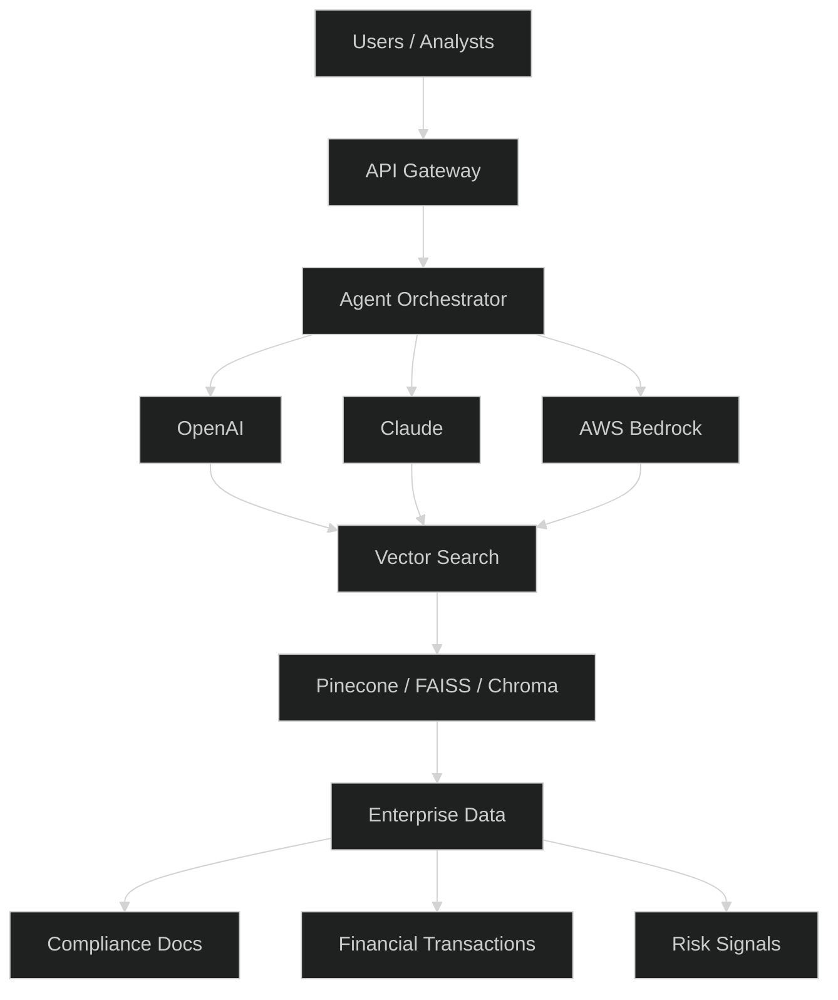
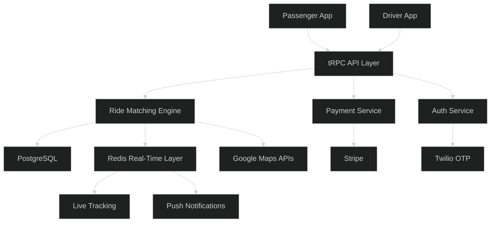

<div align="center">


[](https://git.io/typing-svg)


</div>

---

## 🧭 Executive Snapshot

<table>
<tr>
<td width="50%">

### 👨‍💻 Who I Am

AI/ML Engineer with **4+ years of experience** designing and deploying enterprise AI solutions across banking, compliance, risk analytics, fraud detection, Generative AI, and full-stack product development.

- 🏦 Experience with **Capital One** and **HCLTech**
- 🤖 Specialized in **GenAI, RAG, AI Agents, LLMOps, and MLOps**
- 💳 Built systems processing **12M+ financial transactions daily**
- 📚 Developed enterprise RAG systems over **2M+ compliance documents**
- 🚖 Founder and builder of **YOO RideShare Platform**
- ☁️ Multi-cloud experience across **AWS, Azure, and GCP**

</td>
<td width="50%">

### 📍 Availability

| Item | Status |
|---|---|
| Location | Jersey City, New Jersey |
| Work Authorization | F-1 OPT |
| U.S. Work Status | Authorized to Work |
| Availability | Open to Full-Time |
| Work Mode | Hybrid / Remote / Onsite |
| Relocation | Open |

</td>
</tr>
</table>

---

## 💼 Open To Opportunities

<div align="center">


</div>

---

## 📊 Executive AI Dashboard

<div align="center">

| 4+ Years | 12M+ / Day | 2M+ Docs | AWS • Azure • GCP |
|---|---|---|---|
| AI/ML Experience | Transactions Processed | Documents Indexed | Cloud Platforms |

| GenAI + RAG | Agentic AI | MLOps | YOO RideShare |
|---|---|---|---|
| AI Specialization | Workflow Automation | Production Pipelines | Founder Project |

</div>

---

## 📈 Engineering Impact

| Domain | Scale |
|---|---|
| Financial Transactions | 12M+/day |
| Compliance Documents | 2M+ indexed |
| AI Infrastructure | Enterprise-scale ML and RAG systems |
| Real-Time Systems | Fraud detection, dispatch, tracking |
| Cloud Platforms | AWS, Azure, GCP |
| Full-Stack Products | Mobile + Backend + AI |

---

## 🧠 Technology Command Center

<div align="center">

### AI / ML / GenAI


### Cloud / MLOps / Data


### Full Stack / Product Engineering


</div>

---

## 🧩 Skill Matrix

```text
Expert
├── LLM Systems
├── Retrieval-Augmented Generation
├── Agentic AI Workflows
├── Fraud Detection Models
├── Production MLOps
└── Python / SQL / ML Systems

Advanced
├── Cloud AI Infrastructure
├── Data Engineering Pipelines
├── Model Monitoring
├── API Development
├── Vector Databases
└── Distributed Systems

Strong
├── React Native Applications
├── Full-Stack Product Engineering
├── Real-Time Systems
├── Payment Integrations
├── Maps & Location Services
└── Product Architecture
```

---

## 📊 GitHub Intelligence Dashboard

<div align="center">


</div>

---

## 📈 Contribution Activity

<div align="center">

[](https://github.com/ashutosh00710/github-readme-activity-graph)

</div>

---

## 🏗️ Enterprise AI Architecture



---

## 🚖 YOO RideShare System Architecture



---

## 💳 Fraud Detection ML Pipeline


---

## 🏆 Career Timeline

```text
HCLTech
   │
   ├── AI / ML Engineering
   │   ├── NLP Pipelines
   │   ├── Document Intelligence
   │   └── Data Engineering
   │
   ▼
Capital One
   │
   ├── Fraud Detection
   ├── Risk Intelligence
   ├── Enterprise RAG
   ├── MLOps Automation
   └── Agentic AI Systems
   │
   ▼
YOO RideShare
   │
   ├── Founder & Builder
   ├── Full-Stack Mobility Platform
   ├── Real-Time Matching
   └── Safety-First Transportation
```

---

## 🚀 Featured Engineering Portfolio

| Project | Impact | Stack |
|---|---|---|
| 🚖 **YOO RideShare Platform** | Full-stack rideshare and carpool ecosystem with real-time matching and safety features | React Native, Node.js, PostgreSQL, Redis, Google Maps, Stripe |
| 💳 **Fraud Detection Platform** | Real-time transaction risk scoring at enterprise scale | Python, XGBoost, LightGBM, SageMaker, Kafka, MLflow |
| 📚 **Enterprise RAG Assistant** | Compliance-focused AI assistant over large policy repositories | OpenAI, Claude, Bedrock, LangChain, Pinecone |
| 🤖 **Agentic AI Workflows** | Multi-agent orchestration for enterprise workflows | LangGraph, MCP, LLM Agents |
| ⚙️ **MLOps Pipelines** | CI/CD, model monitoring, drift detection, retraining | Docker, Kubernetes, MLflow, GitHub Actions |
| 📈 **Time Series Forecasting** | Forecasting and trend analysis systems | ARIMA, Prophet, LSTM, Plotly |

---

## 🚖 Flagship Product — YOO RideShare Platform

<table>
<tr>
<td width="55%">

### Product Vision

YOO is a next-generation rideshare and carpool platform designed to connect drivers and passengers through intelligent route matching, real-time tracking, safety-first experiences, and scalable backend architecture.

### Core Features

- Driver & Passenger Modes
- Smart Carpool Matching
- Scheduled Rides
- Real-Time Driver Tracking
- Google Maps Integration
- Stripe Payments
- OTP Authentication
- Student Verification
- Women-Only Ride Options
- Push Notifications
- Ride Analytics

</td>
<td width="45%">

### System Layers

```text
YOO Platform
├── Mobile App
│   ├── React Native
│   ├── Expo
│   └── TypeScript
│
├── Backend
│   ├── Node.js
│   ├── Express
│   └── tRPC
│
├── Data Layer
│   ├── PostgreSQL
│   ├── Drizzle ORM
│   └── Redis
│
├── Integrations
│   ├── Google Maps
│   ├── Stripe
│   └── Twilio OTP
│
└── Real-Time
    ├── WebSockets
    ├── Driver Tracking
    └── Push Notifications
```

</td>
</tr>
</table>

---

## 💳 Fraud Detection & Risk Intelligence

<table>
<tr>
<td width="50%">

### Business Impact

- Processed **12M+ transactions/day**
- Reduced fraud losses by **31%**
- Reduced false positives by **27%**
- Achieved **sub-80ms inference latency**
- Automated drift detection
- SHAP explainability for compliance

</td>
<td width="50%">

### ML Lifecycle

```text
Fraud Detection Platform
├── Data Ingestion
├── Feature Engineering
├── Feature Store
├── Model Training
│   ├── XGBoost
│   ├── LightGBM
│   └── Deep Learning
├── Model Serving
│   └── SageMaker Endpoint
├── Monitoring
│   ├── Drift Detection
│   ├── SLA Tracking
│   └── Business KPIs
└── Governance
    ├── SHAP Explainability
    └── Model Validation
```

</td>
</tr>
</table>

---

## 📚 Enterprise RAG & Agentic AI

<table>
<tr>
<td width="50%">

### Platform Capabilities

- Semantic search across **2M+ documents**
- Agentic multi-step workflows
- Citation validation
- Hallucination detection
- LLM guardrails
- MCP integration
- Compliance-focused responses

</td>
<td width="50%">

### RAG System Flow

```text
Enterprise RAG Platform
├── Document Sources
│   ├── Policies
│   ├── Reports
│   └── Compliance Docs
│
├── Processing
│   ├── Chunking
│   ├── Embeddings
│   └── Metadata Extraction
│
├── Retrieval
│   ├── Vector Search
│   ├── Reranking
│   └── Hybrid Search
│
├── Generation
│   ├── LLM Router
│   ├── Agent Tools
│   └── Guardrails
│
└── Response
    ├── Citations
    ├── Validation
    └── Audit Logs
```

</td>
</tr>
</table>

---

## 🎯 Current Strategic Focus

```text
2026 Focus Areas
├── Agentic AI Systems
├── Enterprise RAG Platforms
├── AI Infrastructure
├── Production MLOps
├── Fraud Detection
├── Transportation Technology
└── Full-Stack Product Engineering
```

---

## 🧱 Engineering Principles

```text
Build for scale first
├── Design modular systems
├── Automate repeatable workflows
├── Monitor everything in production
├── Keep AI outputs grounded
├── Make systems explainable
├── Optimize after measurement
└── Ship production-grade products
```

---

## 🐍 Contribution Snake

<div align="center">


</div>

---

## 🤝 Connect With Me

<div align="center">

[](mailto:tharunapple.1432@gmail.com)
[](https://tharun-kumar-portfolio.vercel.app)
[](https://www.linkedin.com/in/tharun-kumar-nagipogu)

</div>

---

<div align="center">

### Building AI systems that move from prototype to production 🚀


</div>
